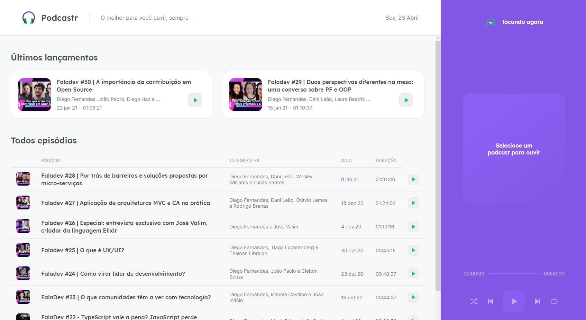
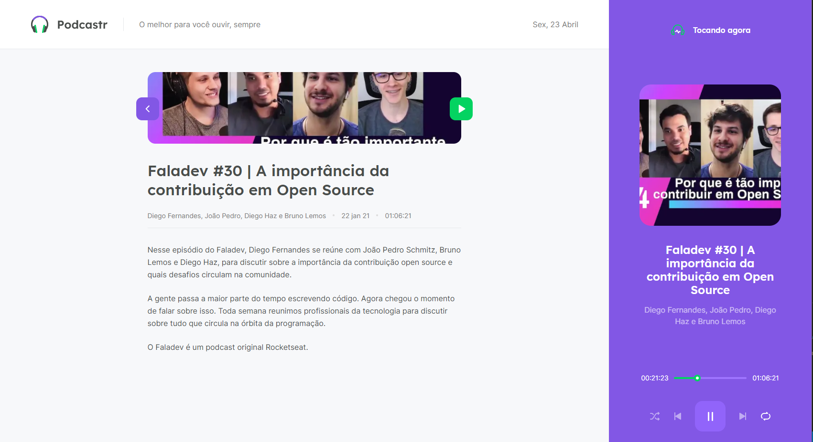

# Podcastr

Esse projeto foi feito seguindo os ensinamentos da Next Level Week da Rocketseat. Esse site busca dados de uma API que retorna podcasts de uma API fictícia. Com a utilização de conceitos do Next e React, como o getStaticProps, context API, SEO.

#

## Tecnologia usada

- Next
- Typescript
- Sass

#

## Features

- Dar play em um Podcast
- Passar de Podcast, voltar, repetir e embaralhar.
- Selecionar um Podcast e ver detalhes sobre ele.

#

## Projeto

#
- Home, onde o usuário pode selecionar o Podcast.

#
- Detalhes do episódio que o usuário selecionou.

#

#
- Player tocando algum episódio que o usuário selecionou.

#

#

## Meta

- Matheus Gomes
- Email - matheusgomes192@hotmail.com
- Linkedin - https://www.linkedin.com/in/matheus-gomes-2a61a8190/ 
